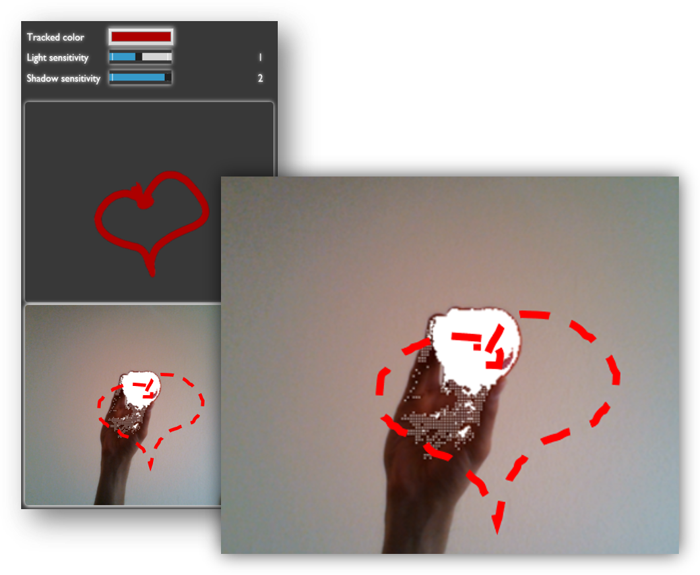
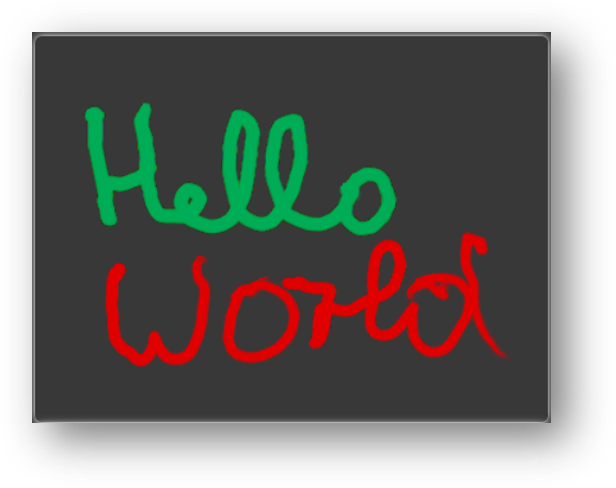
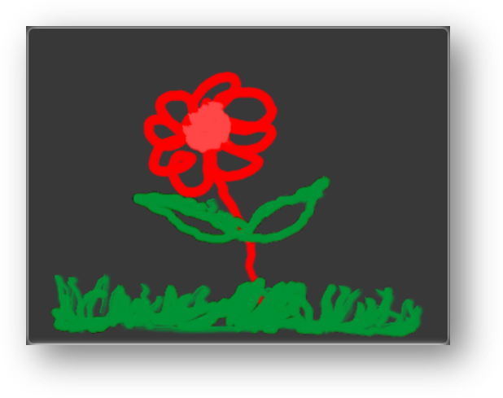
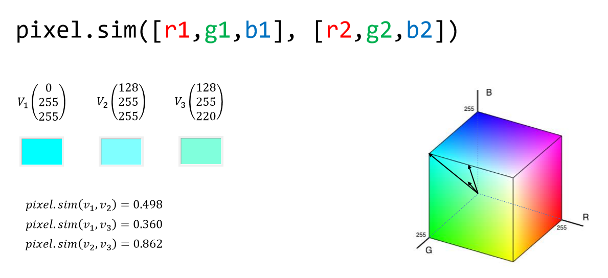
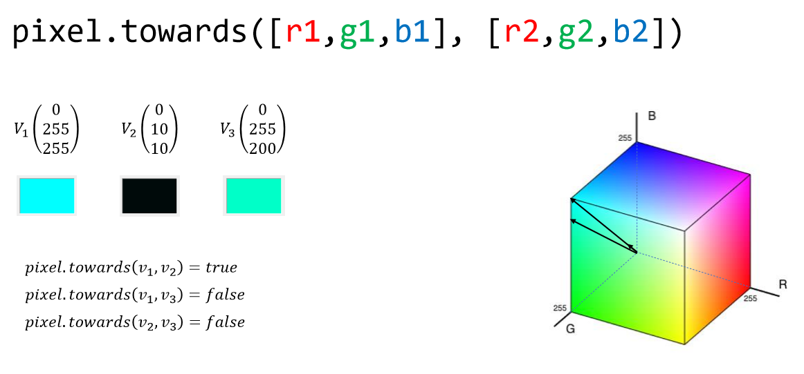
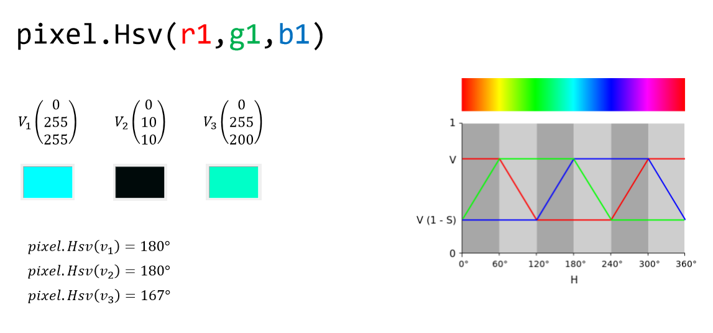
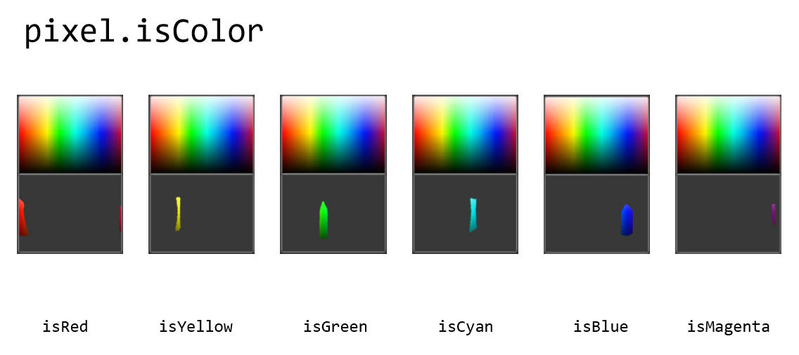
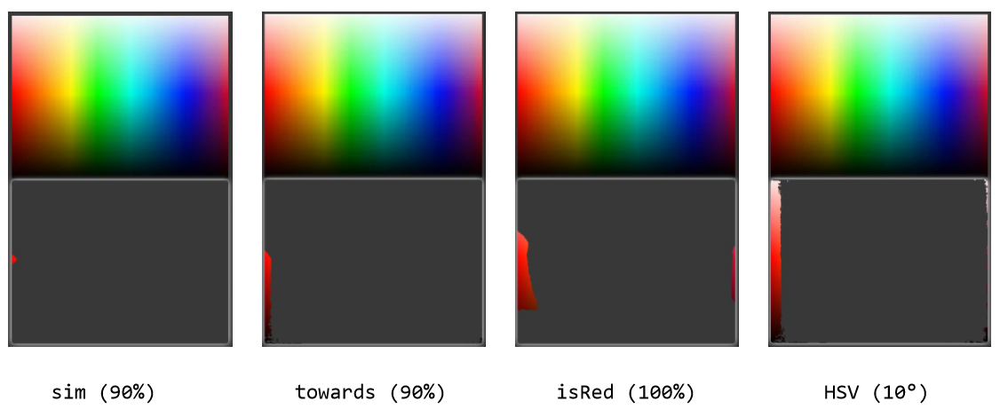

# Draw something


## Overview
Select the color of your object you want to use as a "pen".
Make sure the color is unique. Point with your pen into the camera.
At the very bottom, you can see all pixels being recognized as the tracked color.



## Samples




## Algorithms



```js
pixel.sim = function (a, b) {
  var x = 1 - (Math.abs(a[0] - b[0])
      + Math.abs(a[1] - b[1]
      + Math.abs(a[2] - b[2]))
    / 255;
  return x < 0 ? 0 : x;
}
```

<hr>



```js
pixel.towards = function (a, b, e) {
  e = e || 0.1;

  var maxA = Math.max(a[0], Math.max(a[1], a[2]));
  var maxB = Math.max(b[0], Math.max(b[1], b[2]));

  return Math.abs(a[0] / maxA - b[0] / maxB) < e
      && Math.abs(a[1] / maxA - b[1] / maxB) < e
      && Math.abs(a[2] / maxA - b[2] / maxB) < e;
}
```

<hr>



```js
pixel.HSV = function (r, g, b) {
  r = r / 255; g = g / 255; b = b / 255;

  var maxRGB = Math.max(r, Math.max(g, b));
  var minRGB = Math.min(r, Math.min(g, b));

  return (maxRGB == minRGB) ? [0, 0, r]
      : [60 * (((r == minRGB) ? 3
      : ((b == minRGB) ? 1 : 5)) - ((r == minRGB) ? g - b
      : ((b == minRGB) ? r - g : b - r)) / (maxRGB - minRGB)),
      (maxRGB - minRGB) / maxRGB, maxRGB];
}
```

<hr>



```js
pixel.isRed = function (r, g, b) {
  g += 1; b += 1;

  return r * pixel.shadow > 100
      && r * pixel.light / g > 3
      && r * pixel.light / b > 3
      && Math.abs(g - b) < 40;
}
```

<hr>

### Comparison for [255, 0, 0]



## Share drawings

This feature is only available if you set up a web-socket-broadcast-server first.
The server must monitor all clients and distribute their broadcast requests to all other clients.
You can implement your own server or using [server.js](src/server.js).
This implementation requires the `ws` node_module.
The client/server app is using a simple communication protocol based on JSON-RPC (http://json-rpc.org/wiki/specification).

Each client gets a unique ID after starting the app.
To get one, they need to send a request to the server:

```js
{ "id": 1, "method": "setup", "params": [] }
```

The server must reply with

```js
{ "id": 1, "result": 10, "error": null }
```


Now the client knows his own ID (10).

The client can send broadcast requests to the server and make all other clients hear him:

```js
{ "method": "broadcast", "params": ["Hello World!"] }
```

The server will send the request to all active clients without any changes.

Clients can share their drawings.
To do so, they must design the `params` object as follows:

```
[ <action>, <client_id>, [ (<x>, <y>, <pressure>)* ] ]
```

for example:

```js
[128, 10, [55, 22, 1.0, 56, 22, 1.1, 57, 23, 1.4, …]]
```

128 stands for “sharing”, 10 is the ID of the client who shares.
The array on the third place contains buffered line strokes.
On the first place of the buffer array you will find the x coordinate,
on the second place the y coordinate.
The third place holds the pressure sensitivity.
Then it starts again with the x coordinate for the next line stroke.

Instead of 128 you can use 256.
This tells that the client has deleted his drawing.
Other clients can react to these broadcasts and modify their drawings.

If you want to watch your friend drawing, you can do so by setting the `window.listen` property to the ID of your friend.
If you want to share your drawings with other clients, you have to set `window.share = true`.
You can do it via console or url:
Simply navigate to `/#listen10` or `/#share`.
Navigating to `/#reset` will reset all settings.
